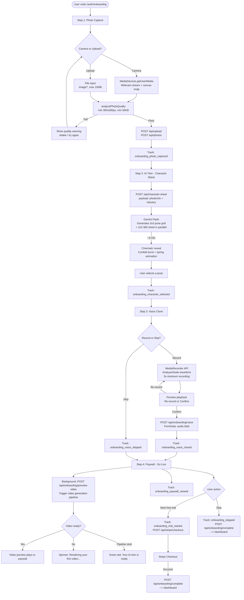
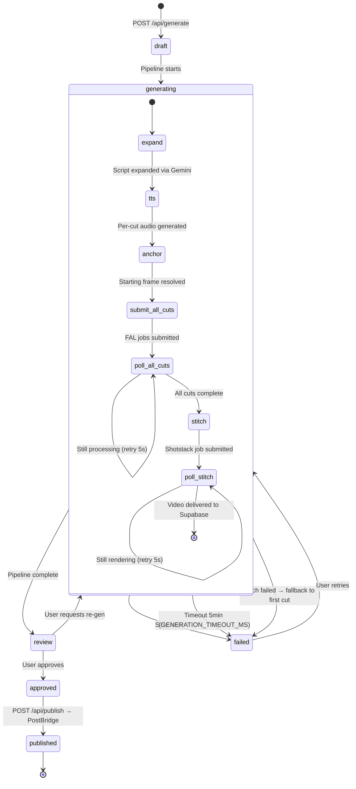
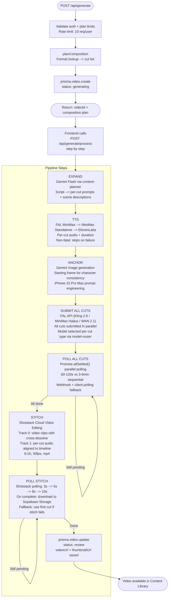
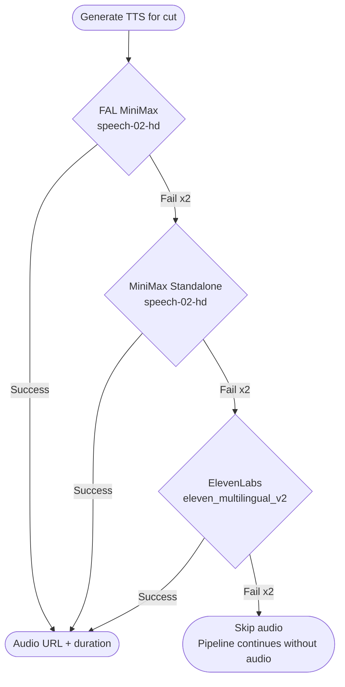
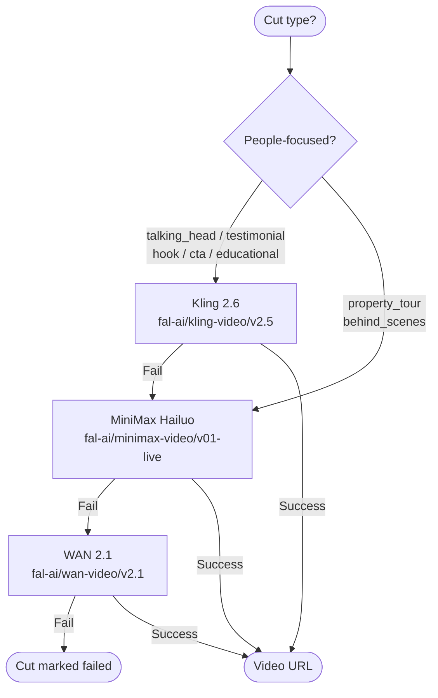

# Official AI — Pipeline Architecture

_Last updated: March 31, 2026_

---

## Onboarding Flow (V2)



---

## Video Generation Pipeline — State Machine



---

## Pipeline Step-by-Step (7 Steps)

The pipeline is split into two HTTP calls to work around serverless timeouts:
- **POST /api/generate** — Fast (< 500ms): creates DB record, returns video ID
- **POST /api/generate/process** — Called repeatedly by the frontend, one step at a time



---

## External API Call Map

```mermaid
flowchart LR
    subgraph APP [Official AI - Next.js]
        O[Orchestrator] --> EX[expand.ts]
        O --> TT[tts.ts]
        O --> AN[anchor.ts]
        O --> CS[cut-submit-all.ts]
        O --> CP[cut-poll-all.ts]
        O --> SS[stitch-submit.ts]
        O --> SP[stitch-poll.ts]
    end

    subgraph GEMINI [Google Gemini]
        G1[gemini-flash\nScript expansion]
        G2[gemini-3-pro-image\nStarting frame gen]
        G3[nano-banana-pro\nCharacter sheets]
    end

    subgraph FAL [FAL.ai]
        F1[kling-video/v2.5\nPrimary video]
        F2[minimax-video/v01-live\nFallback video]
        F3[wan-video/v2.1\n2nd fallback]
        F4[minimax/speech-02-hd\nPrimary TTS]
    end

    subgraph MM [MiniMax Standalone]
        M1[t2a_v2\n2nd TTS fallback]
    end

    subgraph EL [ElevenLabs]
        E1[text-to-speech\n3rd TTS fallback]
    end

    subgraph SHOT [Shotstack]
        SH1[/edit/render\nVideo stitching]
    end

    subgraph SB [Supabase]
        SB1[Storage\nphotos / videos / frames]
        SB2[PostgreSQL\nPrisma ORM]
    end

    EX --> G1
    AN --> G2
    AN --> G3
    TT --> F4
    TT -.-> M1
    TT -.-> E1
    CS --> F1
    CS -.-> F2
    CS -.-> F3
    CP --> F1
    SS --> SH1
    SP --> SH1
    SP --> SB1
    O --> SB2
```

---

## Video Formats — Cut Patterns

```mermaid
gantt
    title Video Format Cut Patterns
    dateFormat s
    axisFormat %S s

    section talking_head_15
    hook (3s)           :0, 3s
    main (8s)           :3, 11s
    cta (4s)            :11, 15s

    section testimonial_15
    hook (3s)           :0, 3s
    testimonial (8s)    :3, 11s
    cta (4s)            :11, 15s

    section testimonial_20
    hook (4s)           :0, 4s
    testimonial_a (6s)  :4, 10s
    testimonial_b (6s)  :10, 16s
    cta (4s)            :16, 20s

    section educational_30
    hook (4s)           :0, 4s
    point_1 (7s)        :4, 11s
    point_2 (7s)        :11, 18s
    point_3 (7s)        :18, 25s
    cta (5s)            :25, 30s

    section quick_tip_8
    hook (2s)           :0, 2s
    tip (4s)            :2, 6s
    cta (2s)            :6, 8s

    section property_tour_30
    intro (4s)          :0, 4s
    exterior (6s)       :4, 10s
    interior_1 (6s)     :10, 16s
    interior_2 (6s)     :16, 22s
    feature (5s)        :22, 27s
    cta (3s)            :27, 30s

    section behind_scenes_20
    hook (3s)           :0, 3s
    scene_1 (6s)        :3, 9s
    scene_2 (6s)        :9, 15s
    reveal (5s)         :15, 20s
```



---

## Shotstack Timeline Construction

```mermaid
flowchart TD
    IN([Cut videos + Per-cut audio]) --> BT[buildTimeline]

    BT --> T0["Track 0: Video Clips\nEach cut = 1 clip\ntrim = targetDuration\ntransition: cross-dissolve fade"]

    BT --> T1["Track 1: Audio Clips\nEach cut = 1 audio segment\nstart = cumulative video offset\nlength = min(audioDuration, cutTrim)"]

    T0 --> TL[Shotstack Timeline JSON]
    T1 --> TL

    TL --> OUT["Output Config\nformat: mp4\nresolution: hd\naspectRatio: 9:16\nfps: 30\nquality: high"]

    OUT --> SUB[POST /edit/{env}/render]
    SUB --> POLL[Poll: 3s --> 5s --> 8s --> 10s]
    POLL -- completed --> DL[Download to Supabase Storage]
    POLL -- failed --> FB[Fallback: use first cut as final video]
    DL --> FINAL([Final video URL + thumbnail])
```

---

## TTS Fallback Chain



---

## Video Model Routing



---

## Onboarding Funnel Events

Tracked via `POST /api/events` -> stored in `LifecycleEvent` table:

| Event | Step | Fires When |
|-------|------|-----------|
| `onboarding_step_photo` | 1 | Photo step mounts |
| `onboarding_photo_captured` | 1 | Photo uploaded successfully |
| `onboarding_step_character` | 2 | Character step mounts |
| `onboarding_character_selected` | 2 | User selects a pose |
| `onboarding_step_voice` | 3 | Voice step mounts |
| `onboarding_voice_cloned` | 3 | Voice sample uploaded |
| `onboarding_voice_skipped` | 3 | User skips voice |
| `onboarding_step_paywall` | 4 | Paywall step mounts |
| `onboarding_paywall_viewed` | 4 | Paywall component mounts |
| `onboarding_trial_started` | 4 | User clicks Start free trial |
| `onboarding_skipped` | 4 | User clicks Skip for now |

Drop-off rate = users who reach each event / users who started onboarding.

---

## API Surface Summary

| Endpoint | Method | Purpose |
|----------|--------|---------|
| `/api/generate` | POST | Create video record + composition plan |
| `/api/generate/process` | POST | Run one pipeline step `{videoId, step, cutIndex?}` |
| `/api/generate/status` | GET | Current video status + step + progress % |
| `/api/generate/advance` | POST | Webhook/polling step progression (idempotent) |
| `/api/generate/batch` | POST | Queue multiple videos from industry templates |
| `/api/generate/retry` | POST | Retry from last failed step |
| `/api/character-sheet` | POST | Generate character sheet (pose grid + 360) |
| `/api/character-sheet` | GET | Get all character sheets for user |
| `/api/photos` | GET/POST | List / upload photos |
| `/api/photos/[id]` | DELETE | Delete a photo |
| `/api/upload` | POST | Multipart upload (photo/voice/video) |
| `/api/onboarding/voice` | POST | Upload voice sample for cloning |
| `/api/onboarding/preview-video` | POST | Trigger preview video in paywall |
| `/api/onboarding/complete` | POST | Mark onboarding finished |
| `/api/publish` | POST | Publish video via PostBridge |
| `/api/social/accounts` | GET | List connected social accounts |
| `/api/stripe/checkout` | POST | Create Stripe checkout session |
| `/api/stripe/webhook` | POST | Stripe webhook handler |
| `/api/usage` | GET | Plan usage metrics |
| `/api/events` | POST | Track lifecycle events |
| `/api/webhooks/fal` | POST | FAL.ai job completion callback |
| `/api/admin/reset-stuck` | GET/POST | Count / reset stuck generating videos |
| `/api/admin/pipeline-log` | GET | Pipeline event timeline for a video |
